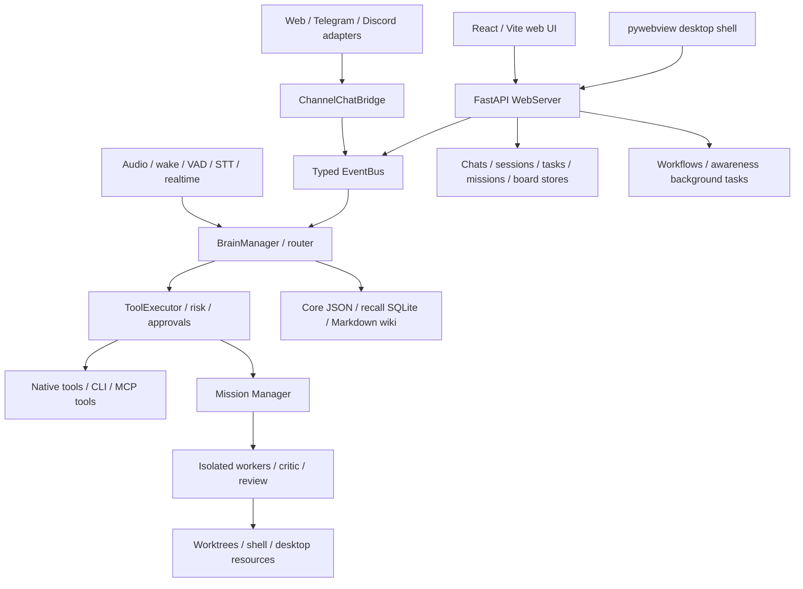

# Current architecture audit

Audited 2026-09-06 at original commit
`4c858fa8822e95e5edc9cf097889930befe9308c`, version 2.0.0.
Scope: read-only source mapping plus the runtime checks in
[BASELINE_TESTS.md](BASELINE_TESTS.md). Source presence is distinct from tested
behavior and from configured external-service access.

## Executive finding

PersonalJarvis already has much of the proposed engine: streaming provider
plugins, a supervisor/mission worker lifecycle, approval machinery, MCP adapters,
skills, channels, workflows, memory and an administrative web UI. Build the fork
by extending these seams. A second supervisor, second generic channel protocol
or parallel memory subsystem would duplicate existing responsibilities.

The principal gaps are durable distributed execution, user/device/channel
identity, independent assistant identity, cloud-safe storage and enforceable
cross-channel permissions. Headless startup alone does not solve these gaps.

## Runtime topology

`jarvis/core/protocols.py` defines shared structural contracts; `core/bus.py` and
typed events provide lateral communication. Plugin entry points are in
`pyproject.toml`; loading is in `core/registry.py`. Several source modules are
large orchestration surfaces, particularly `ui/web/server.py`, `core/config.py`
and `speech/pipeline.py`; avoid cross-cutting bulk edits.

## Entry points and UI

- `run.sh` invokes `jarvis.ui.web.launcher`; `--headless` serves backend without a
  desktop window. `run-dev.sh` selects the distinct development instance.
- `jarvis/__main__.py` exposes the primary CLI; `jarvis/cli_ctl` supplies
  `jarvisctl`/`jctl`. The desktop shell is `jarvis/ui/desktop_app.py`.
- `jarvis/ui/web/frontend` is React 18, TypeScript, Vite, Zustand and TanStack
  Query, with xterm and 3D/visualization dependencies. Compiled assets are checked
  in under `jarvis/ui/web/dist`.
- The existing UI includes chat, voice, agents, skills/plugins/MCPs, CLIs,
  automations, execution inspection, spend, artifacts, wiki, contacts, settings,
  provider keys and an Agentic IDE. This is not yet evidence of an installable,
  offline-capable PWA; no service-worker/manifest implementation was identified
  in the frontend source scan.

`ui/web/server.py` mounts route modules for these domains. `/api/health` is a
basic process/version check. It does not verify LLM, MCP, database recovery or
all route dependencies. `/ws` forwards typed bus events to the browser; additional
WebSockets exist for missions, terminal PTYs, agent chat and telephony media.

## Chat, agents and tools

The normal headless event path persists `MessageSent`, awaits the deferred brain,
and emits the reply. The newer typed-chat service under `jarvis/agent_chat` has
separate brain/API/CLI runners and surface-specific tool kits. Its front-page
chat and Agentic IDE are separate execution surfaces; do not assume their
provider choices or permission ladders are identical.

`jarvis/brain/factory.py` builds tiered `BrainManager` instances and filters router
tools. `jarvis/missions` owns persistent mission state, worktree isolation,
workers, retries, critic/review and recovery. `jarvis/agents/registry.py` builds
the UI's in-memory event tree; it is not a durable central agents table.
Coding integrations include Codex, Claude and Google/Antigravity-related paths,
but no live coding worker was started in the audit.

`jarvis/safety/tool_executor.py`, `risk_tier.py`, and `approval.py` are the
existing action boundary. Tiers are `safe`, `monitor`, `ask`, `block`, rather than
the proposed GREEN/YELLOW/RED vocabulary. Existing whitelists can downgrade an
`ask` action; therefore renaming tier labels would not establish the requested
security policy. Preserve explicit per-action semantics and test precedence.

## Persistence and memory

| Data | Current implementation | Classification | Migration implication |
| --- | --- | --- | --- |
| Runtime configuration | Pydantic `JarvisConfig`, `jarvis.toml`, atomic `config_writer.py` | CONFIG / LOCAL_ONLY | Separate device settings from user settings; preserve old TOML reads |
| Secrets | `get_secret`, OS keyring, environment and restricted fallback file | SECRET / LOCAL_ONLY | Never migrate plaintext into general settings or export logs |
| Core memory | `memory/core_memory.py`, `core_memory.json` | PERSISTENT / LOCAL_ONLY | Small structured user facts; single-process assumptions |
| Recall / wiki candidate journal | `memory/recall.py`, `schema.sql`, migrations, SQLite FTS5/BM25 | PERSISTENT / LOCAL_ONLY | SQL/FTS behavior needs an explicit Postgres adapter and parity tests |
| Knowledge | `memory/wiki`, Markdown vault, guarded atomic writer and index | PERSISTENT / LOCAL_ONLY | Define document ownership/versioning; retain usable local knowledge |
| Chat history | `state/chat_store.py`, `chats.db`; `agent_chat/store.py` | PERSISTENT / LOCAL_ONLY | Inventory both histories before unifying conversation IDs |
| Voice sessions | `sessions/store.py`, `sessions.db` | PERSISTENT / LOCAL_ONLY | Preserve turn provenance, retention and hangup-reason parity |
| Tasks and missions | `tasks/store.py`, `missions/event_store.py`, SQLite | PERSISTENT / LOCAL_ONLY | Transactions, idempotency, leases and replay needed for multiple workers |
| Contacts / friends / board | Domain stores; some under `~/.jarvis` | PERSISTENT / LOCAL_ONLY | User tenancy and linked external identities are missing as a shared contract |
| Traces / errors / costs | Flight recorder JSONL, domain stores, telemetry | PERSISTENT / LOCAL_ONLY | Redaction, retention, correlation and cloud export must be explicit |
| Model/identity/index caches | JSON and in-memory caches | TEMPORARY / LOCAL_ONLY | Rebuild or version; do not migrate caches as authoritative records |
| Artifacts / PTY / desktop state | Files, local processes, OS APIs | LOCAL_ONLY | Cloud metadata plus scoped local bridge; no raw machine exposure |

Operational memory is partly represented by awareness episodes, mission events
and flight-recording, not a single vector store. Working memory includes process
state that will disappear on restart. SQLite durable records do not preserve
all in-memory orchestration automatically.

## Security and deployment findings

1. Loopback browsers are trusted by default when `ui.require_browser_login` is
   false. `surface_security.py` validates origin/host and forwarding indicators;
   remote access uses control keys and session cookies. This is an existing
   single-install boundary, not multi-user cloud authentication/authorization.
2. Calendar `delete_event` is `monitor` and the MCP adapter defaults to `monitor`.
   Shell destructive-command checks exist, but whitelist and explicit-intent
   behavior need reconciliation with the master's RED policy.
3. `JARVIS_DATA_DIR` and `core.paths.user_data_dir()` are different roots. Actual
   startup demonstrated writes/scans outside the requested temporary data root.
4. The app mounts Conductor routes but the tested embedded `/api/conductor/jobs`
   returned 503. The standalone `conductor` package has its own store lifecycle;
   mounting its router is not equivalent to starting that lifecycle.
5. First-run assistant naming and locale defaults differ from the intended
   Jarvis/Portuguese setup; see [IDENTITY_AUDIT.md](IDENTITY_AUDIT.md).

## Automation, updates and CI

`jarvis/workflows` supplies scheduled imperative steps; `conductor` is a separate
YAML/job engine. Awareness supplies background observations and summaries. Their
in-process schedulers require lifecycle ownership; do not start two schedulers
against the same durable records without a leader/lease policy.

`ui/web/update_routes.py` protects source self-update behind a managed-install
marker and matching official origin. This manual fork is outside that update
path. Keep the protection; upstream incorporation should be reviewed in a branch.
`core/branding.py` supports an explicit official-repository override, but simply
pointing it at the fork is not a reviewed release/signing strategy.

`.github/workflows/ci.yml` contains backend gates and frontend Node 22 tests/build.
Ruff/mypy are report-only; backend CI uses a passed-test floor with additional
blocking guards. Push triggers do not currently cover ordinary `develop` or
`feature/*` branches. Installer/release/signing workflows exist; no fork CI,
release, Neon environment or Vercel deployment was triggered or verified.

## Preferred decisions after the audit

Use Node 22, matching the demonstrated green upstream frontend. Retain Python /
FastAPI and the React UI; select the Python version for full local voice after
testing the upstream CI's Python 3.11, since macOS 3.14 loses watcher/ONNX paths.
Reuse existing channel, tool, risk, storage and mission seams. Introduce identity
and cloud persistence incrementally after the original baseline is accepted.
The user's follow-up authorizes better supported options, but it does not make
an untested provider or an incomplete baseline pass.

The only post-audit setup change is `jarvis/ui/web/frontend/.nvmrc` selecting
Node 22, based on the unchanged-source test results. The user chose Gemini for
the real baseline and authorized the original terms; the remaining first-run
blocker is a missing Gemini credential, shown as `NO KEY` in the original UI.
